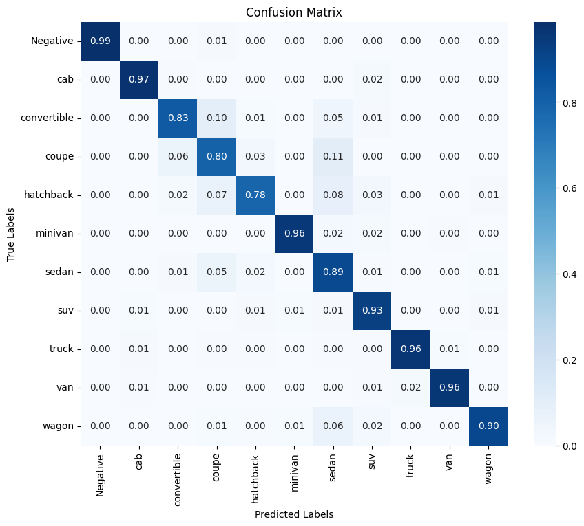

# Deep Learning Models for AI Vehicle Identification/Classification

## Model 01: Azure Custom Vision Endpoint with Azure CV General [A1]  Model

- Model Description:
  - Azure Custom Vision - General [A1]
    - Not Exportable
    - Deployable only as an Azure Custom Vision Endpoint
    - No 'Negative' class used in training.
- Model Traiing and Validation
  - Dataset Description [GitHub Repo - AI Vehicle Identification Datasets](https://github.com/Astrotope/mr-level-05-fsd-mission-01-datasets)
  - Dataset Archive [Google Drive - ai-vehicle-id-dataset.zip](https://drive.google.com/file/d/1o8ZxFqylNY37aoDljaFLhQDxv_iu9PdI/view?usp=drive_link)
- Model Training/Validation - Google Colab Notebook - Azure Custom Vision SDK/API
  - Training Notebook [Google Colab - Custom Vision Training Notebook](mr_level_05_fsd_mission_01_ai_id_train_cv_model.ipynb)
    - [Launch Notebook in Colab](https://colab.research.google.com/drive/1VAEKGBNkQxk8TRcKKLtTfNUpM8_Jj-Rl?usp=sharing)
- Model Performance [MODEL_PERFORMANCE.md](custom-vision/MODEL_PERFORMANCE.md)

## Accuracy, Precision, Recall, and AP

## Model 02: Azure Custom Vision Endpoint with Azure CV General (compact) [S1]  Model

- Model Description:
  - Azure Custom Vision - General (compact) [S1]
    - Exportable to TF (TensorFlow), TFLite, TFLite-fp16, TFJS (also other formats for iOS and Windows)
      - [Exported Models](custom-vision/model-files)
    - Deployable as Azure Custom Vision Endpoint, and in Python, Docker, Javascript, and on Android
    - 'Negative' class included in training.
- Model Traiing and Validation
  - Dataset Description [GitHub Repo - AI Vehicle Identification Datasets](https://github.com/Astrotope/mr-level-05-fsd-mission-01-datasets)
  - Dataset Archive [Google Drive - ai-vehicle-id-dataset.zip](https://drive.google.com/file/d/1o8ZxFqylNY37aoDljaFLhQDxv_iu9PdI/view?usp=drive_link)
- Model Training/Validation - Google Colab Notebook - Azure Custom Vision SDK/API
  - Google Colab Training Notebook [Google Colab - Custom Vision Training Notebook](mr_level_05_fsd_mission_01_ai_id_train_cv_model.ipynb)
    - [Launch Notebook in Colab](https://colab.research.google.com/drive/1VAEKGBNkQxk8TRcKKLtTfNUpM8_Jj-Rl?usp=sharing)
- Model Performance [MODEL_PERFORMANCE.md](custom-vision/MODEL_PERFORMANCE.md)

## Accuracy, Precision, Recall, and AP

## Model 03: Azure ML Endpoint with Google EfficientNet B1 Model (Also testetd MobileNet and ResNet-50. EfficientNet was the best performer.)

- Model Description:
  - Google EfficientNet B1
    - Exportable to TF (PB), TFLite-fp16, TFlite-int8, TFJS [?]
    - Deployable using TensorFlow Serving, Azure ML (with FastAPI, and Docker wrapper).
    - 'Negative' class included in training.
- Model Traiing and Validation
  - Dataset Description [GitHub Repo - AI Vehicle Identification Datasets](https://github.com/Astrotope/mr-level-05-fsd-mission-01-datasets)
  - Dataset Archive [Google Drive - ai-vehicle-id-dataset.zip](https://drive.google.com/file/d/1o8ZxFqylNY37aoDljaFLhQDxv_iu9PdI/view?usp=drive_link)
- Model Training/Validation - Google Colab Notebook - TensorFlow and Keras
  - Google Colab Training Notebook [Google Colab - Keras/TF Training Notebook](mr_level_05_fsd_mission_01_ai_id_train_efficientnet_B1.ipynb)
  - [Launch Notebook in Colab](https://colab.research.google.com/drive/15wRCjwO4vH2VlBnsFZ-5k4z196p5b6gV?usp=sharing)
- Model Deployment
  - Wrapped in an API using FastAPI (Python)
  - Containerized using Docker
  - Pushed to Azure Container Repository
    - Note: Azure ML Endpoint needs Pull Permission from Azure Container Repository. Set this up in Azure Portal - Azure Container Repository
  - Deployed to Provisioned Azure ML Endpoint using Python Deployment Script [Azure Deploy Script](tf-keras-efficient-net/deploy-endpoint-ai-vehicle-id.py)
- Model Performance [MODEL_PERFORMANCE.md](tf-keras-efficient-net/MODEL_PERFORMANCE.md)

## Per-Category Statistics for the Model

| Category       | Precision | Recall | F1-Score | Support |
|----------------|-----------|--------|----------|---------|
| Negative       | 0.95      | 0.99   | 0.97     | 77      |
| Cab            | 0.97      | 0.97   | 0.97     | 711     |
| Convertible    | 0.89      | 0.83   | 0.86     | 1018    |
| Coupe          | 0.77      | 0.80   | 0.78     | 1062    |
| Hatchback      | 0.80      | 0.78   | 0.79     | 535     |
| Minivan        | 0.90      | 0.96   | 0.93     | 246     |
| Sedan          | 0.87      | 0.89   | 0.88     | 1892    |
| SUV            | 0.95      | 0.93   | 0.94     | 1406    |
| Truck          | 0.96      | 0.96   | 0.96     | 235     |
| Van            | 0.97      | 0.96   | 0.96     | 287     |
| Wagon          | 0.83      | 0.90   | 0.86     | 257     |
| **Accuracy**   |           |        | 0.88     | 7726    |
| **Macro Avg**  | 0.90      | 0.91   | 0.90     | 7726    |
| **Weighted Avg** | 0.89    | 0.88   | 0.88     | 7726    |

## Confusion Matrix for Model

