# 30 Epochs Transfer Learning

## Accuracy
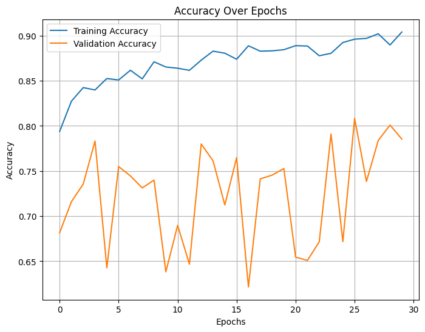

## Loss
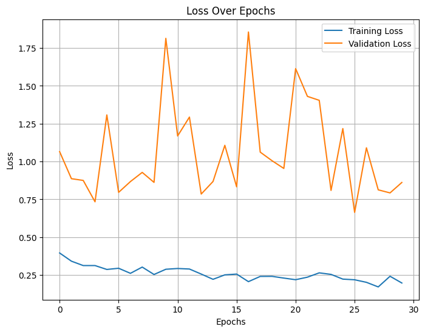

## Precision
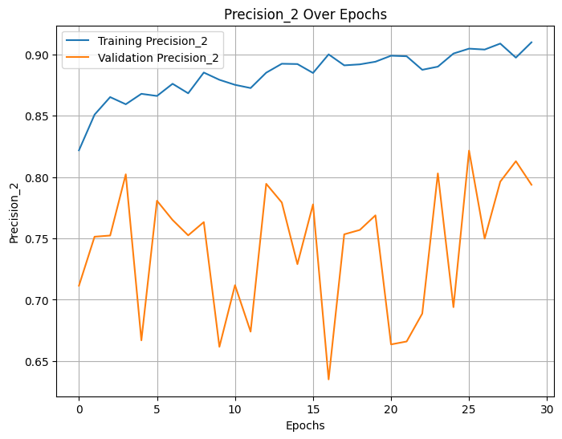

## Recall
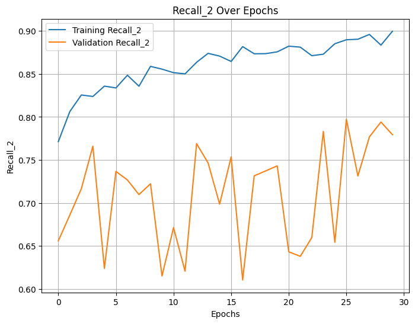

# Plus 10 Epochs of Fine-Tuning

## Accuracy
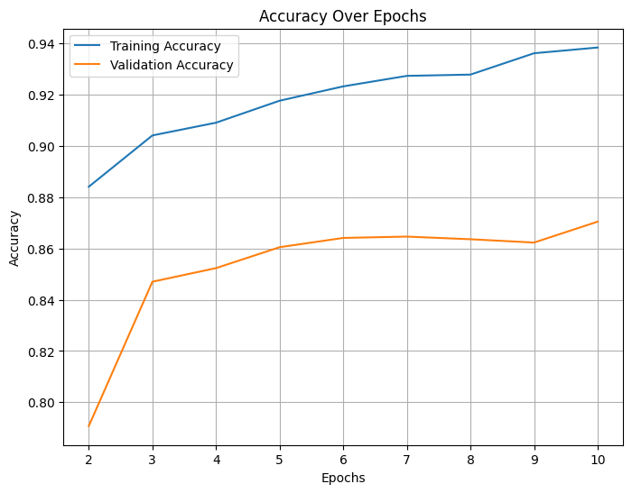

## Loss
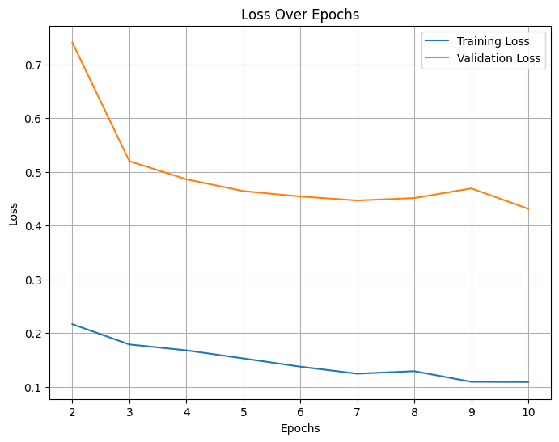

## Precision
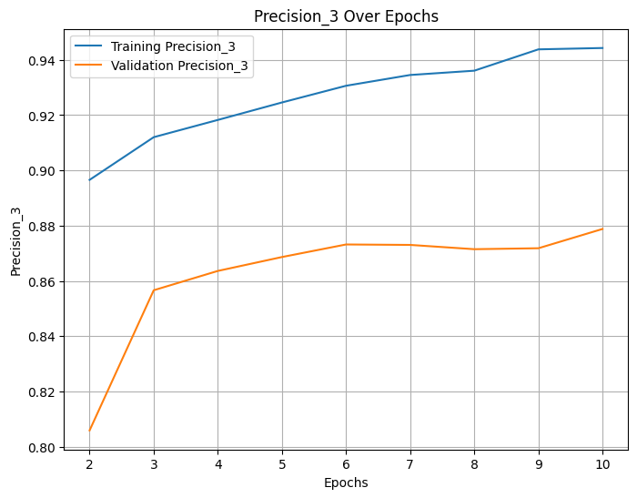

## Recall
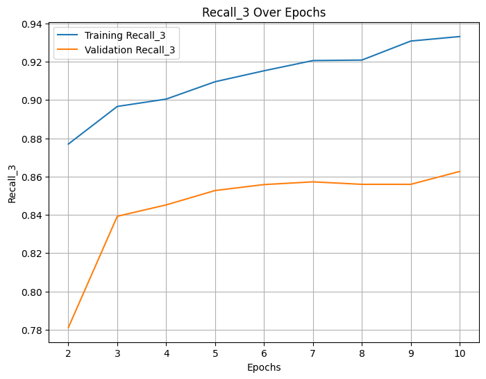

## Per-Category Statistics for the Model

| Category       | Precision | Recall | F1-Score | Support |
|----------------|-----------|--------|----------|---------|
| Negative       | 0.91      | 0.99   | 0.95     | 83      |
| Cab            | 0.95      | 0.97   | 0.96     | 716     |
| Convertible    | 0.86      | 0.84   | 0.85     | 1009    |
| Coupe          | 0.74      | 0.78   | 0.76     | 1056    |
| Hatchback      | 0.79      | 0.75   | 0.77     | 546     |
| Minivan        | 0.82      | 0.97   | 0.89     | 243     |
| Sedan          | 0.86      | 0.86   | 0.86     | 1857    |
| SUV            | 0.96      | 0.91   | 0.93     | 1434    |
| Truck          | 0.97      | 0.95   | 0.96     | 240     |
| Van            | 0.97      | 0.96   | 0.96     | 293     |
| Wagon          | 0.80      | 0.90   | 0.85     | 249     |
| **Accuracy**   |           |        | 0.87     | 7726    |
| **Macro Avg**  | 0.88      | 0.90   | 0.89     | 7726    |
| **Weighted Avg** | 0.87    | 0.87   | 0.87     | 7726    |

## Confusion Matrix

---

# Plus 10 More Epochs of Fine-Tuning

## Accuracy
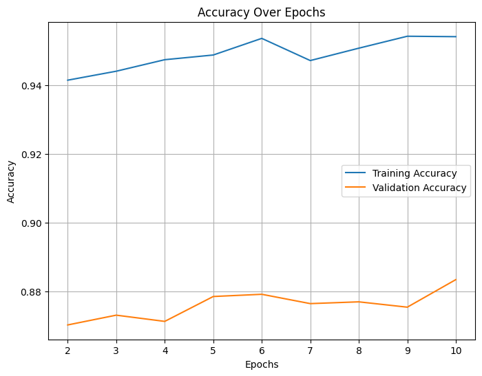

## Loss
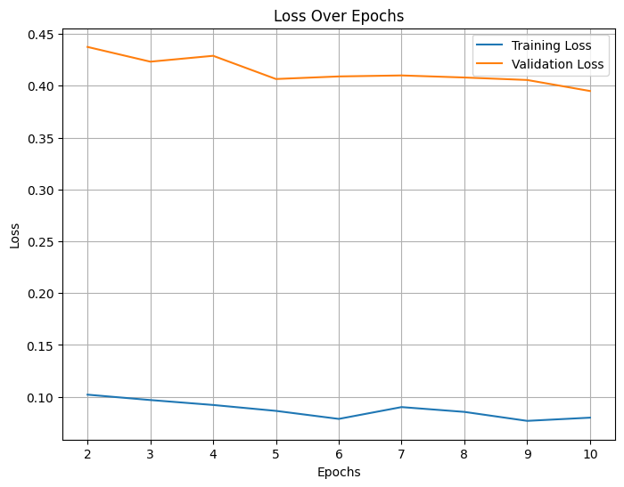

## Precision
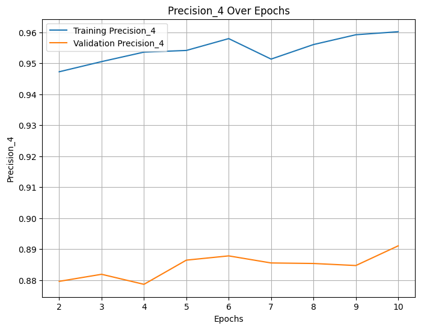

## Recall
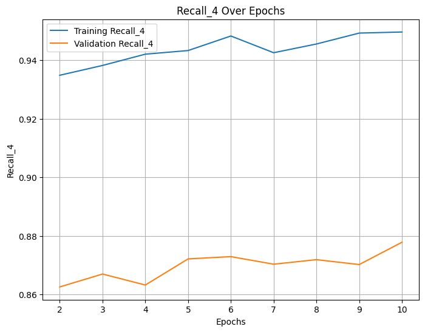

## Per-Category Statistics for the Model

| Category       | Precision | Recall | F1-Score | Support |
|----------------|-----------|--------|----------|---------|
| Negative       | 0.95      | 0.99   | 0.97     | 77      |
| Cab            | 0.97      | 0.97   | 0.97     | 711     |
| Convertible    | 0.89      | 0.83   | 0.86     | 1018    |
| Coupe          | 0.77      | 0.80   | 0.78     | 1062    |
| Hatchback      | 0.80      | 0.78   | 0.79     | 535     |
| Minivan        | 0.90      | 0.96   | 0.93     | 246     |
| Sedan          | 0.87      | 0.89   | 0.88     | 1892    |
| SUV            | 0.95      | 0.93   | 0.94     | 1406    |
| Truck          | 0.96      | 0.96   | 0.96     | 235     |
| Van            | 0.97      | 0.96   | 0.96     | 287     |
| Wagon          | 0.83      | 0.90   | 0.86     | 257     |
| **Accuracy**   |           |        | 0.88     | 7726    |
| **Macro Avg**  | 0.90      | 0.91   | 0.90     | 7726    |
| **Weighted Avg** | 0.89    | 0.88   | 0.88     | 7726    |

## Confusion Matrix

---
